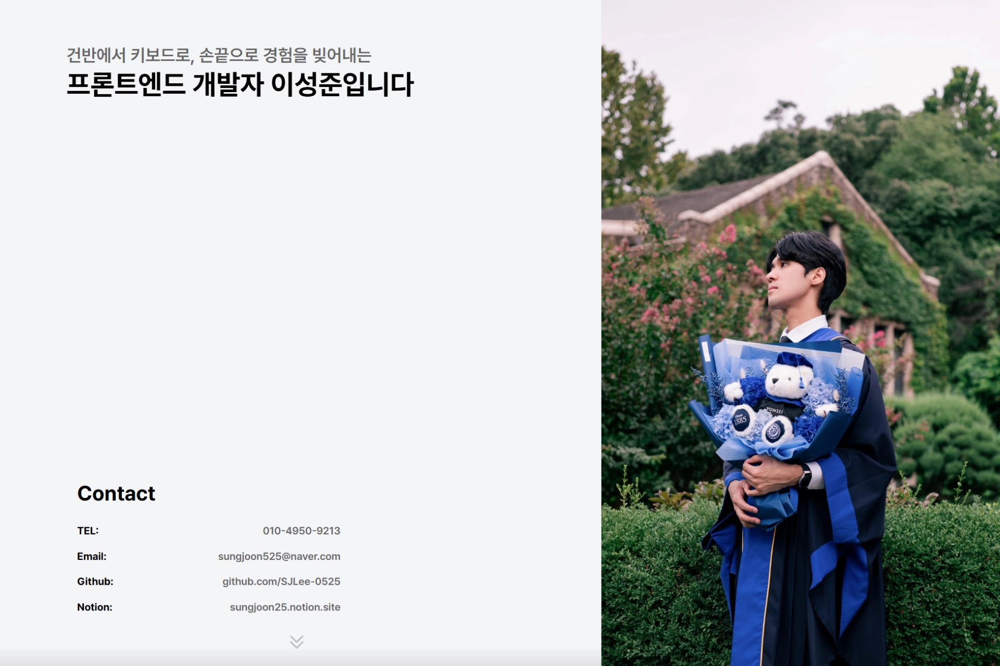
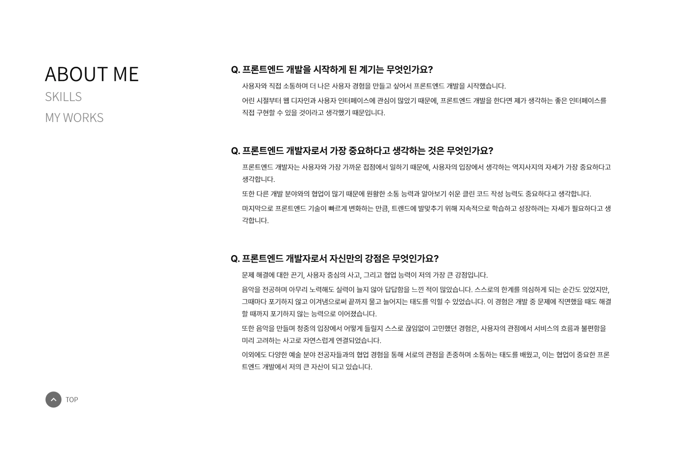
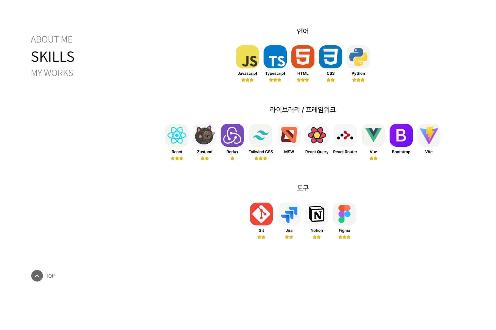
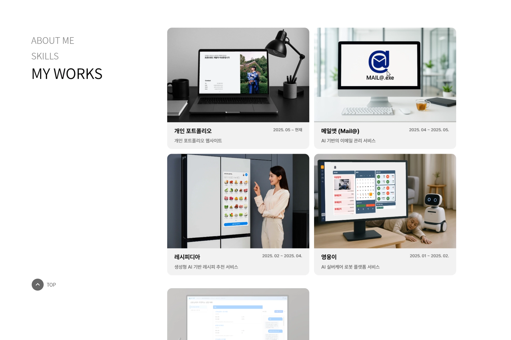
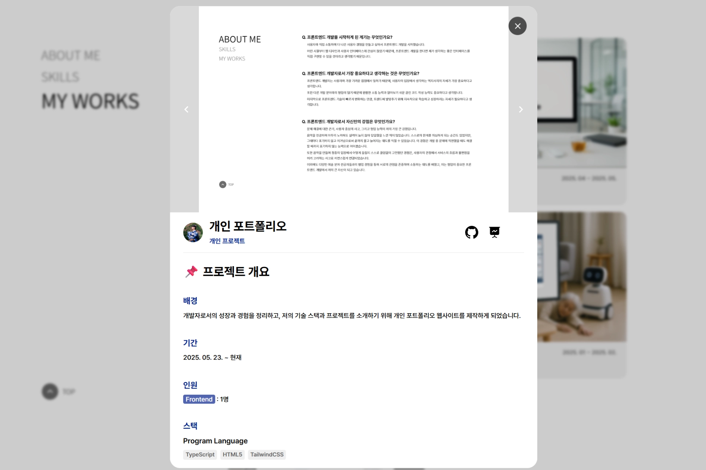
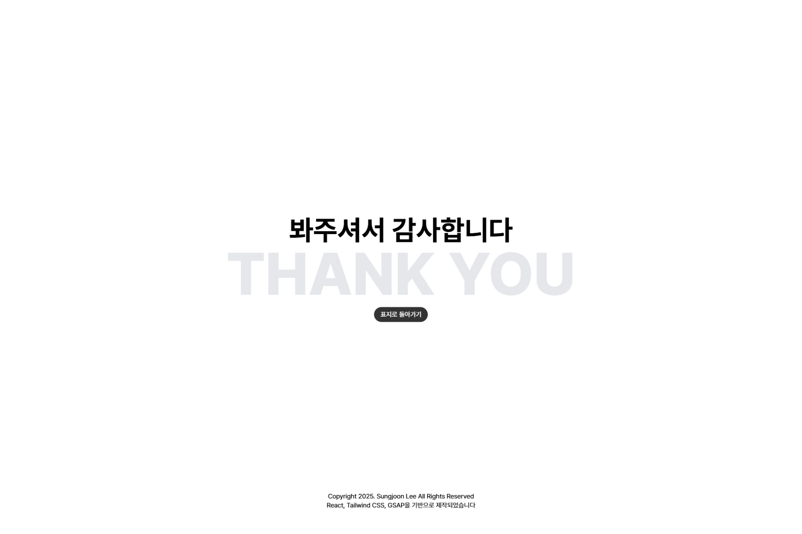
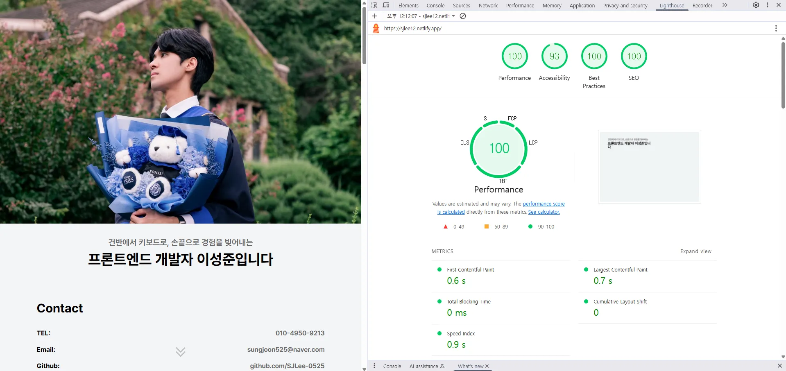

# 📌 개인 포트폴리오

### 배포 주소 : **[https://sjlee12.netlify.app/](https://sjlee12.netlify.app/)**

 

개발자로서의 성장과 경험을 정리하고, 저의 기술 스택과 프로젝트를 소개하기 위해 개인 포트폴리오 웹사이트를 제작하였습니다.

- 🗓️ 기간: 2025. 05. 23. ~ 현재
- 👤 참여 인원: Frontend 1명
- 🔗 GitHub: [개인 포트폴리오 GitHub](https://github.com/SJLee-0525/portfolio)

---

## 🧠 프로젝트 소개

| 항목        | 내용                                                                                                 |
| ----------- | ---------------------------------------------------------------------------------------------------- |
| 🎯 이름     | 개인 프로젝트 - 개인 포트폴리오                                                                      |
| 📝 설명     | 개인 포트폴리오 웹사이트 제작                                                                        |
| 🛠 협업 도구 | GitHub, GitLab                                                                                       |
| 🌐 배경     | 개발자로서의 기술 스택과 프로젝트를 소개하고 정리할 수 있는 웹사이트가 필요하여 제작하게 되었습니다. |

---

## 🛠 사용 기술 스택

### 📌 프로그램 언어

- TypeScript
- HTML5
- TailwindCSS

### ⚙️ 언어 엔진

- Node.js

### 🧩 Web SPA Library

- React.js

### 📦 번들링 툴

- Vite

### 🧠 상태관리

- Zustand

### 🧹 코드 분석 도구

- ESLint, Prettier

### 🔧 기타

- clsx, GSAP, React Router

---

## 💼 담당 역할 및 주요 작업

### 🎨 페이지 UI/UX 설계 및 구현

- 메인 화면, 기술 스택, 자기소개, 프로젝트 목록 페이지 구현

### 🎞️ 자연스러운 애니메이션 효과 구현

- GSAP 및 CSS Keyframes를 활용한 섹션 단위 애니메이션
- 로딩 단계별 애니메이션 처리
- 애니메이션 중 스크롤 방지 및 padding 보정

### 🧭 섹션 이동 기능 구현

- 네비게이션 링크 클릭 시 부드러운 스크롤 이동 구현

### 🪟 모달 기반 UI/UX 설계

- 프로젝트 상세정보 모달 구현
- React `createPortal`로 독립 DOM 트리 구성
- 배경 스크롤 방지 및 padding 유지

### 📱 반응형 웹 구현

- TailwindCSS를 이용한 모바일/데스크탑 대응
- 다양한 해상도에서 최적화된 레이아웃 제공

---

## 🛠 트러블슈팅 경험

| 문제 상황                                    | 해결 방법                                                                      |
| -------------------------------------------- | ------------------------------------------------------------------------------ |
| 스크롤 방지 시 스크롤바 제거로 레이아웃 깨짐 | `overflow-hidden` 적용 시, 스크롤바 너비만큼 `padding-right` 보정              |
| 새로고침 시 스크롤 위치 복원 문제            | `scrollRestoration='manual'` 설정 + `location.hash` 초기화 후 `scrollTo(0, 0)` |
| 타이핑 효과 구현 중 한글 깨짐                | `spread operator([...text])`로 완성형 문자 기준 배열화 후 처리                 |

---

## 📸 프로젝트 이미지

- 
- 
- 
- 
- 
- 

---

## 🪞 프로젝트 회고

- 개인 포트폴리오 웹사이트를 제작하며, 기술적 성장과 경험을 정리할 수 있는 플랫폼을 직접 설계하고 구현할 수 있었습니다.
- 사용자에게 명확하게 전달되는 흐름을 고려하여, 직관적인 페이지 설계와 GSAP 기반의 애니메이션으로 주목도를 높였습니다.
- 정적 페이지를 넘어 반응형 레이아웃과 인터랙티브한 전환 효과를 통해 웹 기술 역량을 입증하고자 했습니다.
- React Lazy Loading 및 코드 스플리팅, SEO 최적화, 메타 태그 구성 등을 통해 성능 및 접근성을 높였고 Lighthouse 점수도 50점대에서 90점대로 개선했습니다.
  
- 이 프로젝트는 단순한 웹사이트를 넘어, 저의 개발 철학과 실력을 종합적으로 보여주는 포트폴리오입니다. 앞으로도 지속적으로 개선해나갈 예정입니다.
